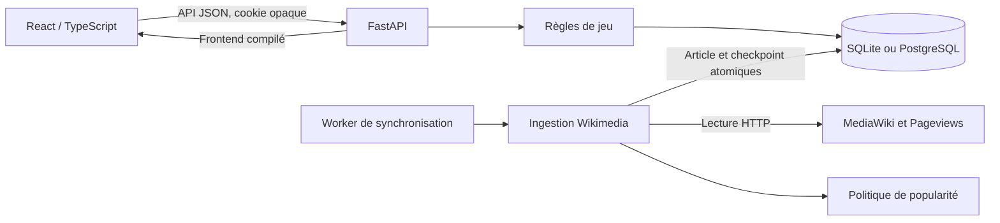
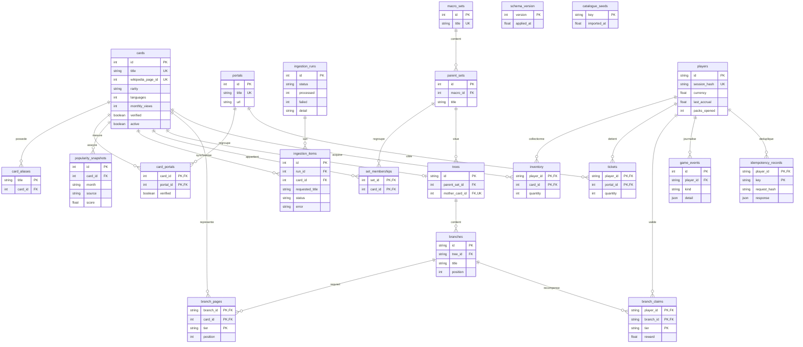

# Architecture de Wikidex

Wikidex sépare le catalogue encyclopédique, les règles de jeu et leur présentation. Le navigateur affiche la collection et anime les ouvertures ; le serveur décide des tirages, du solde, des échanges et des récompenses. Une base relationnelle conserve ces décisions avant que l’interface les révèle.

Cette version est une application locale utilisable, avec un chemin vers PostgreSQL. Elle ne constitue pas un service public dimensionné pour toute Wikipédia. Les limites actuelles sont précisées plus bas.

## Modules et responsabilités

| Module | Responsabilité |
|---|---|
| `frontend/src/App.tsx` | Boutique, collection, arbres, bourse, journal, détails et animations de révélation. |
| `frontend/src/api.ts` | Client HTTP de même origine ; clé d’idempotence conservée lors d’une nouvelle tentative réseau. |
| `frontend/src/types.ts` | Contrats TypeScript et libellés d’affichage. Les constantes client ne font pas autorité pour les mutations. |
| `backend/wikidex/api.py` | FastAPI, validation Pydantic, session, contrôle d’origine, transactions, idempotence et distribution du frontend compilé. |
| `backend/wikidex/game.py` | Économie, tirages, inventaires, ventes, tickets, paliers et projection des arbres selon les possessions. |
| `backend/wikidex/models.py` | Tables SQLAlchemy, clés étrangères, index, contraintes et relations. |
| `backend/wikidex/db.py` | Connexion, réglages SQLite, initialisation et import initial répétable du catalogue. |
| `backend/wikidex/popularity.py` | Politique déterministe et versionnée de classement par popularité. |
| `backend/wikidex/ingestion.py` | Client Wikimedia, validation des articles et portails, collecte des mesures, checkpoints et reprise. |
| `scripts/import_catalogue.py` | Commandes `sync`, `worker` et `status`, configuration et verrou du worker local. |
| `data/catalogue.json` | Catalogue éditorial initial et structure des arbres issus du prototype. |



## Modèle relationnel

Le schéma contient **21 tables : 19 tables métier et 2 tables techniques** (`schema_version`, `catalogue_seeds`). Les objets `CardAlias` et `IngestionItem` normalisent respectivement les anciens titres et les points de reprise.

Le diagramme montre les clés et relations structurantes ; les champs descriptifs, métadonnées d’image et horodatages supplémentaires restent définis dans `models.py`. `PK` désigne une clé primaire, éventuellement composée, et `FK` une clé étrangère.



### Identité des cartes et hiérarchie

Une carte correspond à une page individuelle. `cards.id` est l’identité stable utilisée par les possessions et les arbres ; `wikipedia_page_id` devient disponible après validation Wikimedia. Le titre peut être normalisé ou redirigé sans changer l’identité interne. `card_aliases` conserve les titres historiques pour la migration des sauvegardes.

La hiérarchie éditoriale est **Macro-Ensemble → Set Parent → Carte Mère → Branches → Feuilles**. Les branches et ensembles organisent les cartes ; ils ne deviennent pas des cartes abstraites. Une feuille est une référence à `cards`, avec un palier `base` ou `full`. Une page peut figurer dans plusieurs arbres sans dupliquer son identité dans le catalogue.

`set_memberships` décrit les sets parents d’appartenance. `trees`, `branches` et `branch_pages` décrivent les descendants de la mère. Ces relations sont distinctes : participer à une branche ne crée pas implicitement une appartenance à un set parent. Chaque arbre a une seule mère, chaque branche un seul arbre, et une carte mère possède au plus un arbre dans ce schéma.

La base impose notamment les quantités positives ou nulles, le solde entre 0 et 3 000, les valeurs de rareté et les deux paliers autorisés. Les clés composées empêchent les possessions, liens de portail et récompenses en double. Les snapshots sont uniques par carte/mois/source et les checkpoints par travail/carte. Le contenu éditorial des relations, notamment le choix des feuilles, reste une responsabilité du catalogue : une clé étrangère valide ne prouve pas la pertinence encyclopédique d’un lien.

## Transactions de jeu et idempotence

Chaque mutation suit la même frontière transactionnelle :

1. Valider le corps, l’origine HTTP et `Idempotency-Key`.
2. Ouvrir une transaction et verrouiller l’état du joueur avant de le lire pour modification.
3. Rechercher une réponse enregistrée pour ce joueur et cette clé. Une répétition identique renvoie cette réponse ; une autre route ou un autre corps avec la même clé est refusé.
4. Calculer la Curiosité écoulée depuis l’horodatage serveur, puis appliquer l’opération et ses récompenses.
5. Enregistrer les acquisitions, le journal et la réponse d’idempotence dans la même transaction.
6. Valider la transaction avant de répondre au navigateur.

SQLite utilise `BEGIN IMMEDIATE`, qui réserve l’écriture avant la lecture des compteurs. PostgreSQL utilise `SELECT … FOR UPDATE` sur le joueur : les mutations d’une même partie sont sérialisées. Les erreurs avant validation annulent toute l’opération. Le pack est débité et les cartes sont possédées avant l’animation ; fermer ou recharger pendant la révélation ne perd donc pas les cartes.

Le client conserve sa clé pendant ses tentatives réseau d’une même action. Le registre d’idempotence conserve la réponse initiale : il évite un second débit, mais une réponse rejouée n’est pas une nouvelle lecture de l’état courant. `GET /api/state` permet de resynchroniser l’affichage.

`game_events` fournit un journal des acquisitions, ventes, conversions, imports et paliers. Ce journal n’est pas un mécanisme de reconstruction intégrale : les accruals passifs et toutes les anciennes valeurs ne sont pas enregistrés comme événements. La base relationnelle reste la source de vérité.

### Invariants économiques

Le taux passif reste **1 Curiosité/seconde**, y compris après absence, jusqu’au plafond **3 000**. Un recul de l’horloge ne remet pas à disposition du temps déjà crédité. Le coût standard est **300 pour 4 cartes**, soit cinq minutes de génération passive ; les ventes et bonus peuvent financer des ouvertures supplémentaires. La nouvelle partie reprend les **600 Curiosité** et le **ticket Physique** du prototype lorsque ce portail existe.

La vente rapporte respectivement **30, 75, 150, 300, 600** par doublon selon sa rareté actuelle. Vente et conversion conservent toujours au moins un exemplaire. Le crédit effectif est tronqué au plafond et annoncé comme tel. La conversion exige une carte active et vérifiée et un lien de portail vérifié. Un ticket finance une seule carte du portail, sans coût de Curiosité ; un portail sans candidat éligible ne consomme pas le ticket.

## Brouillard encyclopédique et paliers

Le serveur applique le brouillard avant sérialisation. Une mère absente produit uniquement un identifiant public opaque et `locked=true`. Dans un arbre accessible, une feuille non possédée produit uniquement `owned=false` ; son titre, identifiant de carte, illustration et autres métadonnées ne partent pas vers le client. Les sets parents exposés sont filtrés par les arbres débloqués.

L’évaluation des paliers ignore les arbres dont la mère est absente. Elle ne renvoie donc aucune notification d’étape révélant leur contenu. La base exige toutes les pages de contexte ; le palier complet exige la base **et** toutes les pages précises. Les récompenses nominales sont respectivement **150** et **400**.

La clé `(player_id, branch_id, tier)` de `branch_claims` rend chaque attribution unique. Un doublon ne peut pas redonner la récompense. Si les feuilles précises précèdent les pages de base, le dernier contexte peut valider les deux paliers. Si la mère arrive après les feuilles, l’arbre est réévalué à l’acquisition : les récompenses jusque-là cachées sont accordées une fois lors du déblocage.

## Pipeline encyclopédique et reprise

Le catalogue initial est marqué `metrics_source=prototype` et `verified=false`. Il permet de jouer avant synchronisation ; ses mesures et associations initiales ne sont pas présentées comme des données fraîchement vérifiées. Les boosters standards peuvent contenir ces cartes initiales actives. Les conversions et boosters portail exigent en revanche des associations vérifiées. Ce choix de démarrage doit être conservé visible dans l’interface.

La synchronisation traite les titres déjà présents au catalogue. Elle résout les redirections, valide une vraie page d’article (`ns=0`), parcourt toutes les continuations de langues et catégories, puis valide les portails candidats (`ns=100`). Les vues portent sur le dernier mois UTC complet de Wikipédia francophone, lecteurs humains (`user`) et tous modes d’accès. Une indisponibilité réseau n’est jamais convertie en mesure nulle.

Chaque article est lu sur le réseau **en dehors** d’une transaction SQL, puis ses données, portails, snapshot et checkpoint sont validés ensemble. `ingestion_items` contient les éléments `pending`, `complete`, `failed` ou `blocked`. La lecture des éléments à traiter se fait par lots de 100. Une reprise garde le mois d’origine et saute les éléments terminés ; les snapshots sont mis à jour sans doublon pour un même mois/source.

Une page inexistante ou hors de l’espace article est désactivée sans supprimer les possessions. Une collision de titres canoniques est bloquée pour réconciliation explicite, sans fusion silencieuse. Les arbres qui référencent ces pages peuvent nécessiter une correction éditoriale avant de redevenir complétables. L’ingestion enrichit et valide les pages ; elle ne génère pas automatiquement de nouveaux arbres.

Le client Wikimedia applique un intervalle entre requêtes, des tentatives bornées et `Retry-After`. Le worker local reprend les travaux incomplets et possède un verrou de fichier libéré par le système après arrêt. Les commandes, paramètres, limites réseau et rapports sont détaillés dans `docs/INGESTION.md`.

### Popularité et tirage sont deux politiques distinctes

La politique `log-rank-v1` calcule :

```text
score = 0,45 × ln(1 + langues) + 0,55 × ln(1 + vues_mensuelles)
```

Les cartes actives sont classées par score puis par titre en cas d’égalité. Une place est réservée à chaque rareté, puis les autres sont réparties selon **50 / 30 / 14 / 5 / 1 %**, par la méthode des plus grands restes. Ce sont des proportions de **cartes dans le catalogue**. Les plus populaires sont classées dans les raretés supérieures. Le recalcul intervient à la fin de la synchronisation et peut modifier la rareté d’une carte déjà possédée, ainsi que la valeur de ses doublons.

Le booster standard choisit ensuite une rareté avec des poids entiers sur 10 000 : **5 500 / 2 800 / 1 200 / 450 / 50**, soit strictement **55 / 28 / 12 / 4,5 / 0,5 %**. Il choisit uniformément une carte dans cette rareté avec `secrets.randbelow`. Un groupe vide bloque l’achat sans débit ; aucun repli silencieux ne change ces probabilités.

Un portail peut ne pas posséder les cinq raretés. Son tirage renormalise les mêmes poids entre les groupes disponibles, et l’API fournit ses probabilités effectives pour affichage. La garantie porte sur l’appartenance au portail. Imposer les cinq taux standards à un portail sans carte mythique serait impossible ; cette exception est explicite.

## Sessions, import et protection de l’API

Une session anonyme est créée par `GET /api/state`. Le cookie contient un secret aléatoire ; la base conserve son empreinte SHA-256. Le cookie est `HttpOnly`, `SameSite=Strict`, et peut être `Secure` par configuration HTTPS. Les mutations exigent une clé d’idempotence et refusent les origines non autorisées. Les réponses de jeu sont non mises en cache ; les requêtes SQL sont construites par SQLAlchemy et les textes encyclopédiques affichés comme texte.

Il n’existe pas de comptes nominatifs, mot de passe, récupération de session, synchronisation interappareils ou administration des utilisateurs. Perdre le cookie empêche de retrouver directement la partie anonyme. Un export JSON conserve les quantités, mais ne remplace pas une sauvegarde complète de la base, de ses paliers et de son historique.

L’import du prototype est volontairement limité à une partie vierge, une seule fois, à un client local, et peut être désactivé. Les quantités et le solde sont bornés, les titres résolus par les alias, les inconnus signalés et l’ancienne horloge ignorée. Il s’agit d’une migration de données déclarées par l’utilisateur, pas d’une preuve d’acquisition adaptée à une économie publique compétitive.

## SQLite, PostgreSQL et limites de montée en charge

SQLite est le moteur local par défaut, avec clés étrangères activées, journal WAL et attente de verrou bornée. Cette solution simplifie l’installation et rend les mutations atomiques sur un fichier. Les transactions d’écriture sont cependant sérialisées à l’échelle de la base ; les routes de lecture du jeu qui ouvrent `BEGIN IMMEDIATE` participent également à cette contention.

`DATABASE_URL` permet une connexion PostgreSQL, avec verrouillage par joueur. Changer cette variable crée ou utilise une autre base : **cela ne copie pas les données SQLite**. Une migration existante demande export/transfert contrôlé des tables en conservant leurs identifiants, vérification des contraintes et remise à niveau des séquences. La concurrence et les tests de cette version reposent sur SQLite ; un déploiement PostgreSQL doit être validé avec son pilote et sa propre campagne de tests.

Les limites à traiter avant un service important sont explicites :

- **Évolution du schéma :** `create_all` et `schema_version` initialisent les tables ; ils ne fournissent pas de migrations de colonnes versionnées avec retour arrière. Ajouter un outil de migration avant de modifier un schéma déjà déployé.
- **Lectures en mémoire :** le tirage charge le catalogue actif, l’état charge l’inventaire entier et l’évaluation parcourt les arbres. Certains parcours utilisent des relations chargées à la demande. Prévoir pagination, requêtes ciblées, préchargement des relations et pools de tirage indexés pour de gros volumes.
- **Historique :** les réponses complètes d’idempotence incluent l’état du joueur, et leur conservation n’a pas encore de politique de purge. Journaux, snapshots et réponses doivent recevoir une politique d’archivage ; la durée d’idempotence garantie doit rester cohérente avec celle-ci.
- **Worker unique :** le verrou local protège un workspace, pas plusieurs machines. L’exécution distribuée requiert une file durable, une attribution atomique des tâches et une coordination par base ou service de verrous.
- **Volume Wikipédia :** les API par article conviennent à ce catalogue sélectionné. Une ingestion de millions de pages nécessite des dumps et des traitements par lots ; changer de base ne résout pas ce coût réseau.
- **Exploitation publique :** l’authentification de comptes, quotas, limitation des requêtes, observabilité, sauvegardes restaurables et tests de charge restent à ajouter selon le déploiement. Aucun dimensionnement de production n’est revendiqué.

## Vérification et décisions de conception

Les tests métier de `backend/tests/test_game.py` couvrent la génération fixe et le plafond, les frontières exactes des probabilités, le refus de pools incomplets, les paliers uniques et leur ordre d’acquisition, le brouillard côté API, les ventes, les portails, l’import, les sessions isolées, l’idempotence, les appels concurrents et l’annulation d’un achat interrompu.

Les tests d’ingestion de `backend/tests/test_ingestion.py` utilisent un transport HTTP simulé pour vérifier redirections, continuations, validation des portails, erreurs réseau, limites de tentatives, mesures absentes, popularité déterministe, snapshots, collisions, désactivation et reprise après interruption. Ils ne démontrent pas que l’environnement d’exécution peut joindre Wikimedia : une synchronisation réelle et son rapport constituent cette vérification distincte.

Depuis la racine du projet :

```powershell
.venv\Scripts\python.exe -m pytest backend/tests -q
```

Les décisions structurantes sont la conservation d’une identité de carte stable, des relations d’appartenance séparées de la descendance, des récompenses enregistrées une seule fois, un brouillard appliqué sur le serveur et des acquisitions durables avant animation. La mesure de popularité est automatisée et traçable ; les liens encyclopédiques qui composent les arbres restent éditoriaux. Ces frontières permettent d’agrandir le catalogue et de changer l’interface sans déplacer les règles économiques vers le client.
